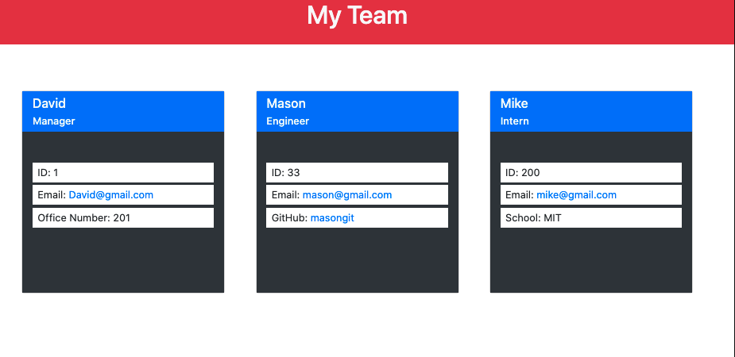

# team-profile

[](https://opensource.org/licenses/MIT)

A command line app that allows you to generate a team using Node. Object Oriented Programming and Test Driven Development was used to create the employee classes. When you start the application, the user is prompt with questions to create a team using inquirer. Once the user is done creating the team, an index.html file is creating to display the team.




|                                         |                                         |                                                   |
| :-------------------------------------: | :-------------------------------------: | :-----------------------------------------------: |
|      [Introduction](#team-profile)      | [Table of Contents](#table-of-contents) | [Development Highlights](#development-highlights) |
|      [Installation](#installation)      |             [Tests](#tests)             |       [Code Hightlights](#code-highlights)        |
| [Technologies Used](#Technologies-Used) |           [Credits](#Credits)           |                [License](#License)                |

## Development Highlight

- Use Node.JS file system modules (writeFile)
- Test Driven Development and Object Oriented Programming to create emplyee classes.
- Use inquirer to prompt users and validate the answers.

## Installation

Install dependencies.

```
npm i
```

Run the app.

```
node server.js
```

## Test

```
npm test
```

## Code Highlights

Create an Employee class where the other types of employees will extend from this class.

```JavaScript
class Employee {
    constructor(name, id, email) {
        this.name = name;
        this.id = id;
        this.email = email;
    }
    getName() {
        return this.name;
    }
    getId() {
        return this.id;
    }
    getEmail() {
        return this.email;
    }
    getRole() {
        return 'Employee';
    }
}
```

The classes for each employee type is stored in an array. The data is filtered for engineers. For each engineer, a card is created to show the information.

```JavaScript
const generateEngineerCards = dataArray => {
    let templateData = ""
    let engineers = dataArray.filter(data => data.constructor.name === "Engineer");
    engineers.forEach(engineer => {
        templateData += `
        <div class="card m-4" style="width: 20rem; height: 20rem;">
            <div class="bg-primary h-25">
                <h5 class="card-title text-light pt-2 pl-3">${engineer.name}</h5>
                <h6 class="card-subtitle mb-2 pl-3 text-light">Engineer</h6>
            </div>
            <div class="bg-dark  h-100">
                <div class="bg-white ml-3 mr-3 mt-5">
                    <p class="mb-1 pl-2 py-1">ID: ${engineer.id}</p>
                </div>
                <div class="bg-white mt-0 ml-3 mr-3 ">
                    <p class="mb-1 pl-2 py-1">Email: <a href="mailto:${engineer.email}">${engineer.email}</a></p>
                </div>
                <div class="bg-white ml-3 mr-3 ">
                    <p class="mb-1 pl-2 py-1">GitHub: <a href="https://github.com/${engineer.github}">${engineer.github}</a></p>
                </div>
            </div>
        </div>
        `
    })
    return templateData;
}
```

## Technologies Used

### Frontend Languages

- [HTML](https://www.w3schools.com/html/)

### Design Libraries

- [Bootstrap](https://getbootstrap.com/)

### Backend Languages

- [Node.js](https://nodejs.org/en/)

### NPM Dependencies

- [Inquirer.js](https://www.npmjs.com/package/inquirer)

### Test

- [Jest](https://jestjs.io/)

## Credits

|                           |                                                                                                                                                                                                       |
| ------------------------- | ----------------------------------------------------------------------------------------------------------------------------------------------------------------------------------------------------- |
| **David Anusontarangkul** | [ LinkedIn](https://www.linkedin.com/in/anusontarangkul/) [ GitHub](https://github.com/anusontarangkul) |

## License

[](https://opensource.org/licenses/MIT)
